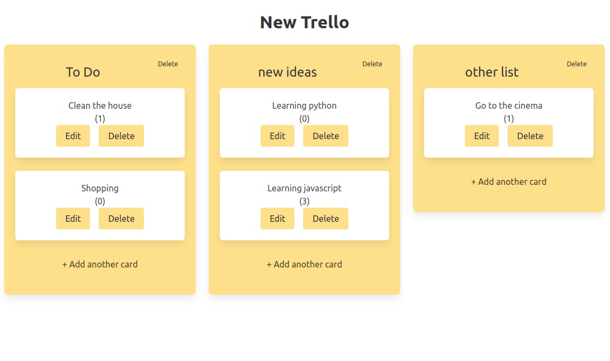
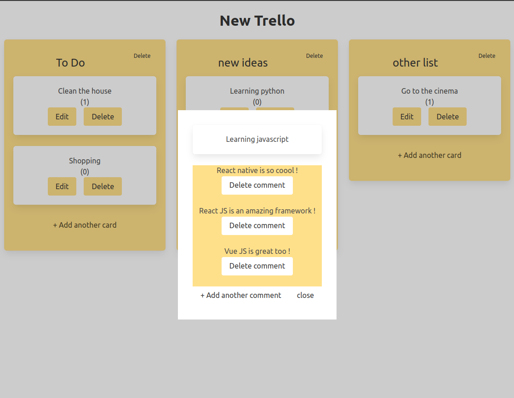

# TrelloLike
This project is a Trello-like website with a wordpress back-end API and a Vue.js front-end. CSS is done with Bulma.

## Description
TrelloLike allows you to create lists, cards, comments, and to manage them (show, add new, edit and delete).
The number of comments is shown in the card and the comment part is shown in a modal when you click on the card.
